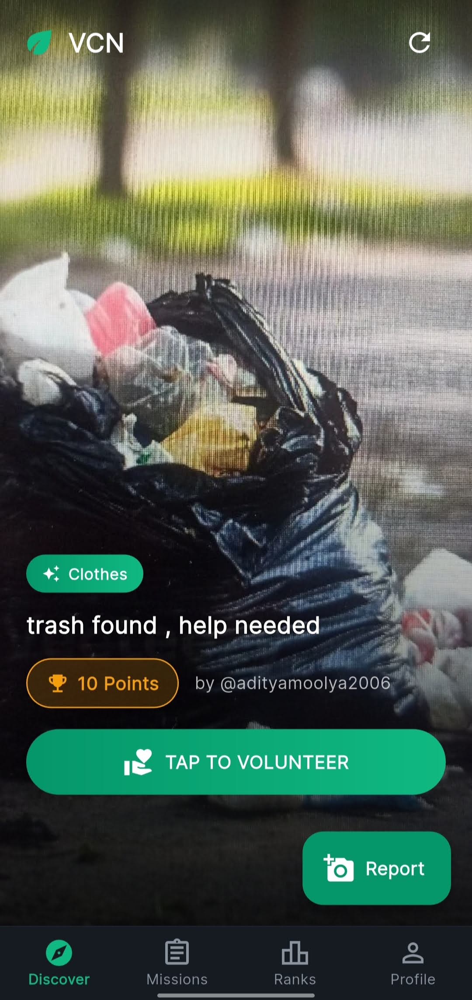
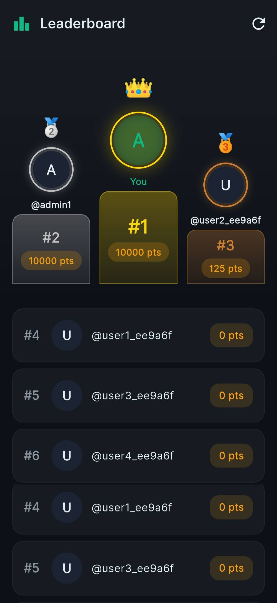
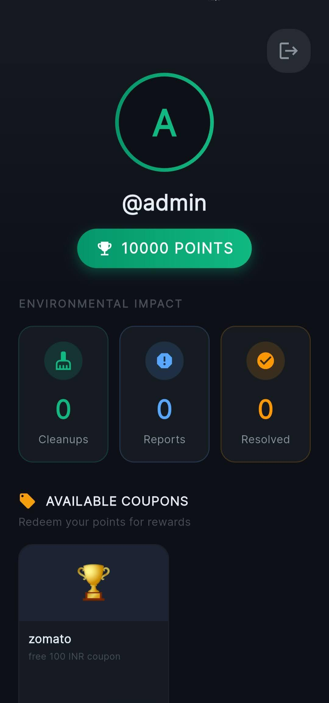
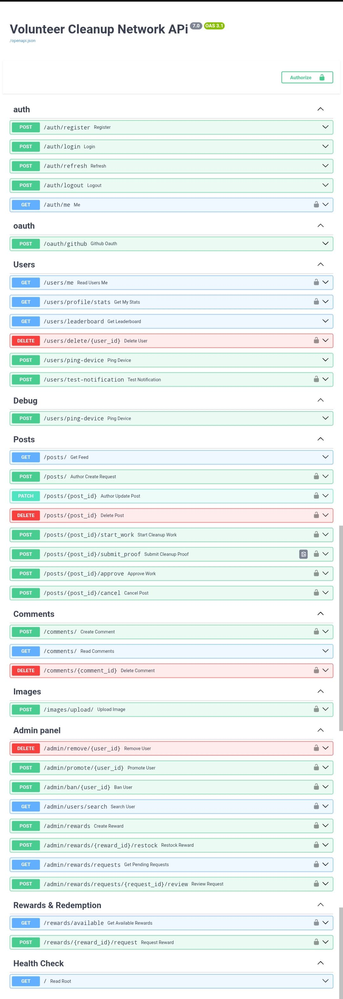

# Volunteer Cleanup Network

<div align="center">

  
  
  
  
  
  
  

  <br />

  **[Download the latest .apk](https://drive.google.com/drive/folders/166HY1sx200e-gqqEXpLeeSRyy_l35O4W?usp=sharing)**
</div>

---

The Volunteer Cleanup Network is an automated, community-driven environmental cleanup platform. It gamifies the process of making our communities cleaner by connecting users who discover and report trash with volunteers who step in to perform the cleanup. 

Our system heavily leverages asynchronous machine learning models to automatically categorize the reported trash, assess the severity of the mess, and estimate point rewards, delivering a streamlined, verifiable, and highly engaging user experience.

---

## App Showcase

<div align="center">
  
</div>

### Key Features
<p align="center">
  
  
  
</p>

### Interactive API Documentation

The backend is built with FastAPI and provides auto-generated, interactive Swagger UI documentation for all endpoints.

<div align="center">
  
</div>

---

## Project Workflow

1. **Reporting (Author)**: An author captures an image. The backend stores it in Cloudinary and triggers an asynchronous task to categorize the trash via the ML service.
2. **Discovery**: Open tasks are displayed on the mobile feed for volunteers to view.
3. **Clock-In (Volunteer)**: GPS data verifies the volunteer is at the site. The volunteer submits a "before" photo, the server records the start time, and a second ML check verifies the trash state.
4. **Clock-Out (Volunteer)**: After cleaning, the volunteer submits a proof photo. The backend calculates cleanup duration and updates the status to pending approval.
5. **Resolution (Author)**: The author reviews the evidence bundle and approves the point payout, closing the case and awarding the volunteer.
6. **Redemption**: Volunteers can browse the reward catalog and redeem the points they earned for various rewards.

---

## High-Level Architecture 

- **Frontend (Mobile)**: Flutter, Dart, Dio, Geolocator, Google Maps, Firebase Messaging.
- **Backend (API)**: FastAPI, SQLAlchemy (Async), PostgreSQL/SQLite, Upstash Redis, Firebase Admin SDK.
- **AI Microservice**: YOLOv8 model (exported to ONNX) running as an independent HTTP service (sibling Docker container).
- **Infrastructure**: AWS EC2 (Backend + ML hosting), Cloudinary (Images), Nginx + Certbot (HTTPS), DuckDNS (DNS).

---

## Repository Structure

```
volunteer-cleanup-network/
├── backend/               # FastAPI backend + auth module
├── docs/media/            # App screenshots, demo GIFs, and banners
├── flutter_source_code/   # Flutter mobile app (Android)
├── trash_classifier/      # ML microservice (YOLOv8/ONNX trash classifier)
└── docker-compose.yml     # Orchestrates backend + ML containers
```

---

## Detailed Documentation

| Component | README |
|-----------|--------|
| **Backend** | [backend/README.md](./backend/README.md): API endpoints, database models, volunteer workflow, deployment guide (EC2, Nginx, Docker, HTTPS), security hardening |
| **Auth Module** | [backend/auth/README.md](./backend/auth/README.md): JWT + refresh token system, OAuth setup, Redis caching, provider swapping |
| **Flutter App** | [flutter_source_code/README.md](./flutter_source_code/README.md): App architecture, screens, services, setup guide, theming |

---

## Quick Start (Local Development)

1. Clone the repo and set up `backend/.env` with at minimum a `DATABASE_URL` and `JWT_SECRET`.
2. From the repo root, run `docker compose up --build` to start both the backend and ML service.
3. The backend is available at `http://localhost:8080`, ML service at `http://localhost:6969`.
4. Point the Flutter app's `.env` at `http://10.0.2.2:8080` (Android emulator) and run `flutter run`.

See the individual READMEs linked above for full setup details, environment variables, and production deployment instructions.
